# 🏦 iM PASS — 외국인 근로자 신원·자격 지갑 & 생활금융 플랫폼

<p align="center">
  
  
  
</p>

<p align="center">
  <strong>“흩어진 자격을 내 지갑에 안전하게, 필요한 순간 금융으로 바로 연결하다”</strong><br>
  2026 AI Blockchain Challenge in Daegu 출품 동작형 프로토타입
</p>

<p align="center">
  
  
  
  
  
  
</p>

<br>

> **iM PASS(Worker Pass)** 는 외국인 근로자가 자신의 **체류·취업 자격**을 모바일 단말에 안전하게 보유하고, 제출할 때마다 실시간 검증을 거쳐 **60초 Dynamic QR**로 필요한 항목만 선택 제출하며, 검증된 자격을 바탕으로 **급여계좌 개설 · 해외송금(환율보장) · 적금 · 퇴직급여(출국만기보험/퇴직연금 DC)** 까지 한 번에 누리는 **블록체인 기반 올인원 생활금융 신원지갑**입니다.

---

## 🧭 목차 (Table of Contents)

1. [기획 배경 및 문제 인식](#1-기획-배경-및-문제-인식)
2. [iM뱅크가 이 혁신의 중심에 서는 이유](#2-im뱅크가-이-혁신의-중심에-서는-이유)
3. [전체 시스템 아키텍처 & 흐름도](#3-전체-시스템-아키텍처--흐름도)
4. [사용자 맞춤형 3대 화면 체계 (HTML Web UI)](#4-사용자-맞춤형-3대-화면-체계-html-web-ui) — 실제 화면 캡처 포함
5. [핵심 기술 및 서비스 특징](#5-핵심-기술-및-서비스-특징)
6. [시드 인물 페르소나 (시연 시나리오)](#6-시드-인물-페르소나-시연-시나리오)
7. [연계 발급기관 인터페이스 (8개 기관)](#7-연계-발급기관-인터페이스-8개-기관)
8. [기술 스택 상세](#8-기술-스택-상세)
9. [빠른 실행 및 시연 가이드](#9-빠른-실행-및-시연-가이드)
10. [REST API 명세](#10-rest-api-명세)
11. [비즈니스 기대효과 & 확장 로드맵](#11-비즈니스-기대효과--확장-로드맵)

---

## 1. 기획 배경 및 문제 인식

<p align="center">
  
</p>

> **"기관마다 파편화된 서류, 반복되는 대조 절차, 낡은 증명서의 위험"**

* **서류의 극심한 파편화**: 체류자격은 출입국·외국인청, 고용이력은 고용센터, 건강검진은 의료기관, 한국어 능력은 산업인력공단 등으로 흩어져 있어 근로자는 같은 서류를 수차례 재발급받아야 합니다.
* **사업장 확인 부담**: 중소 제조업체 등 사업장 담당자는 외국인 근로자 1명을 채용·관리하기 위해 여러 공공 포털을 개별 조회해야 하므로 행정 리소스 소모가 큽니다.
* **낡은 증명서(Stale Credential)의 한계**: 기존 종이 증명서나 정적 PDF/스크린샷은 중간에 비자가 만료되거나 자격이 철회되어도 즉각 알 수 없는 구조적 맹점이 존재합니다.

---

## 2. iM뱅크가 이 혁신의 중심에 서는 이유

> **"카카오 인증서가 통신사 본인확인 위에 세워졌듯, iM PASS는 은행 창구 실명확인 위에 세워집니다."**

```
[외국인 근로자 입국] 
       │
       ▼
 [iM뱅크 창구 방문]  ── 법적 필수 대면 실명확인 (여권 + 외국인등록증 원본 대조)
       │
       ├─▶ 추가 절차 없는 유일한 오프라인 접점
       ├─▶ 단말 ECDSA P-256 개인키 등록 (은행은 "지갑의 소유자"만 보증)
       ▼
 [iM PASS 발급 완료] ──▶ B2B2C 연계: 사업장 한 곳 유치 시 근로자 수백 명 급여계좌 확보
```

* **절차를 늘리지 않는 유일한 오프라인 접점**: 근로자는 급여 수령을 위해 입국 후 반드시 은행 창구를 방문해 실명확인(KYC)을 거칩니다. iM PASS는 이 법적 대조 절차를 그대로 레버리지합니다.
* **B2B2C 대규모 고객 유치**: 대구·경북 및 전국 국가산단 내 기업 고객과 연계 시, 기업 도입 하나만으로 외국인 근로자 수백 명의 주거래 급여계좌를 일시에 유치할 수 있습니다.
* **외환·외화 송금 시장 선점**: 특정 급여일에 본국으로 일괄 송금되는 대규모 외환 수요를 예측·집계하여 환헤지(FX Hedge) 및 외환 수수료 수익 구조를 만듭니다.

---

## 3. 전체 시스템 아키텍처 & 흐름도

iM PASS는 **"개인정보 0% 온체인 기록"** 원칙과 **"제출 시점 실시간 조회(Zero-Storage)"** 아키텍처를 따릅니다.

### 📊 전체 시스템 흐름도
<p align="center">
  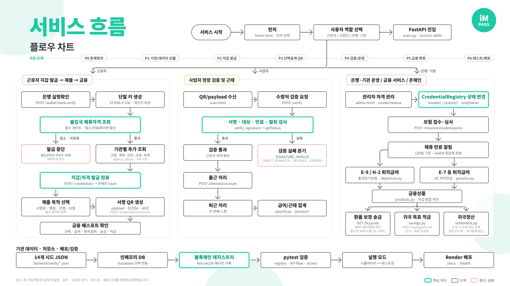
</p>

### 🏛️ 서비스 아키텍처 구조
<p align="center">
  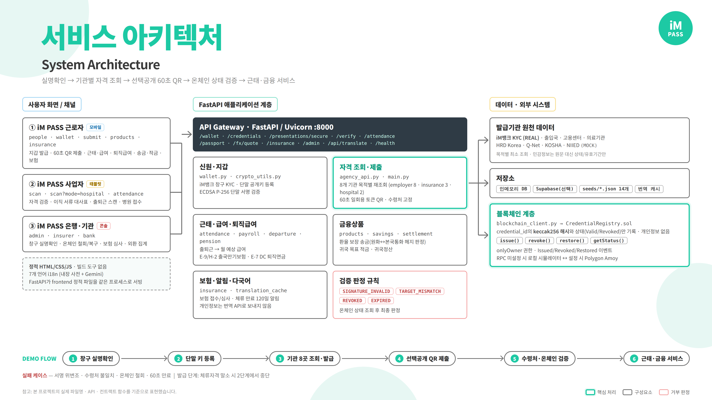
</p>

---

## 4. 사용자 맞춤형 3대 화면 체계 (HTML Web UI)

iM PASS는 iM뱅크 브랜드 정체성을 담은 3가지 전용 역할을 제공합니다. (기본 포트: `http://127.0.0.1:8000`)

| 역할 | 테마 컬러 | 대상 기기 | 주요 기능 및 화면 |
|:---:|:---:|:---:|:---|
| **iM PASS 근로자**<br>(개인 모바일) | **iM Blue**<br>`#2878FF` | 스마트폰<br>(Mobile Web) | • **지갑 발급 & 대시보드** (`wallet.html`)<br>• **60초 제출 Dynamic QR** (`submit.html`)<br>• **맞춤 생활금융/적금/송금** (`products.html`)<br>• **퇴직급여 & 보험 접수** (`insurance.html`) |
| **iM PASS 사업자**<br>(기업 현장) | **iM Mint**<br>`#00C7A9` | 태블릿 · 키오스크<br>(Tablet/Kiosk) | • **QR 즉시 스캔 & 위변조 검증** (`scan.html`)<br>• **출퇴근 스캔 및 근태 관리** (`attendance.html`)<br>• 거점병원 진료 접수 확인 |
| **iM PASS 은행·기관**<br>(관리자 콘솔) | **Deep Navy**<br>`#172B4D` | PC 데스크톱<br>(Desktop Console) | • **자격 발급·철회·복구 관리** (`admin.html`)<br>• **기업체 급여/외환 영업 집계** (`bank.html`)<br>• 거점병원·보험 심사 접수함 (`insurer.html`) |

> 🎨 **디자인 시스템**: 가독성이 뛰어난 **Pretendard** 서체와 감성적인 인사말을 위한 **IM혜민체**를 하이브리드로 적용하였으며, iM Mint(#00C7A9), iM Blue(#2878FF), Deep Navy(#172B4D)의 통일된 토큰 체계로 심미성과 신뢰성을 극대화했습니다.


### 🖥️ 서비스 런처 — 역할 선택

<p align="center">
  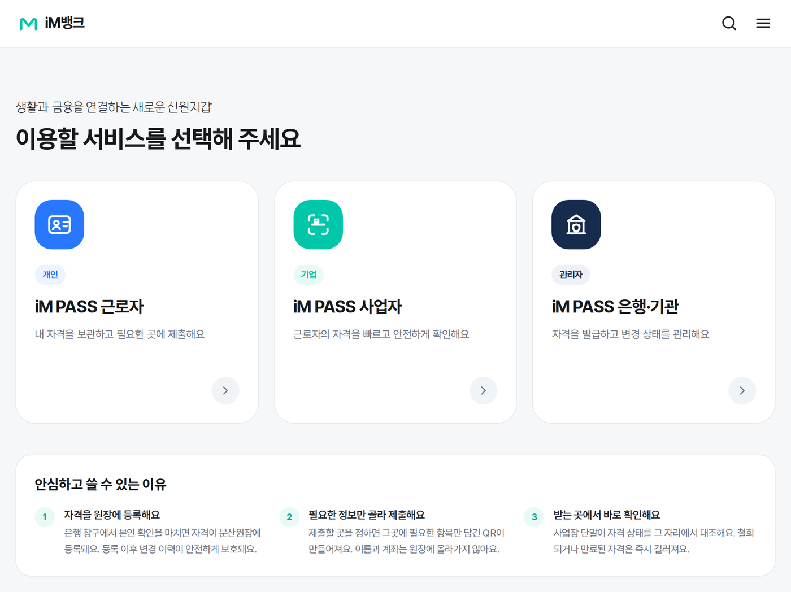
</p>

> 첫 화면에서 **근로자 · 사업자 · 은행·기관** 중 하나를 고릅니다. 실제 서비스에서는 세 역할이 각자 다른 기기에서 쓰지만, 시연에서는 한 화면에서 역할을 바꿔 가며 같은 근로자의 자격이 어떻게 오가는지 보여 줍니다.

### 📱 근로자 화면 (모바일)

<table>
<tr><td align="center" valign="top">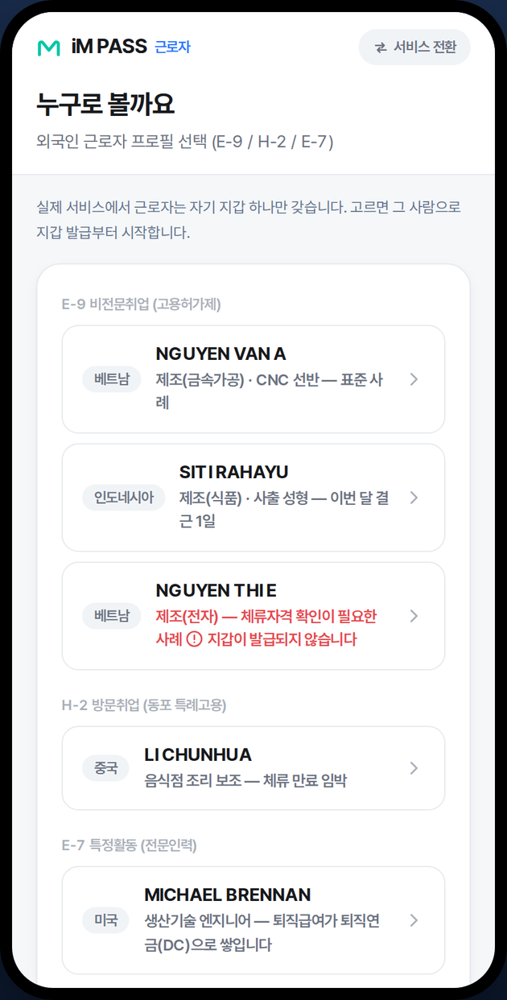<br><sub><b>① 인물 선택</b></sub></td><td align="center" valign="top">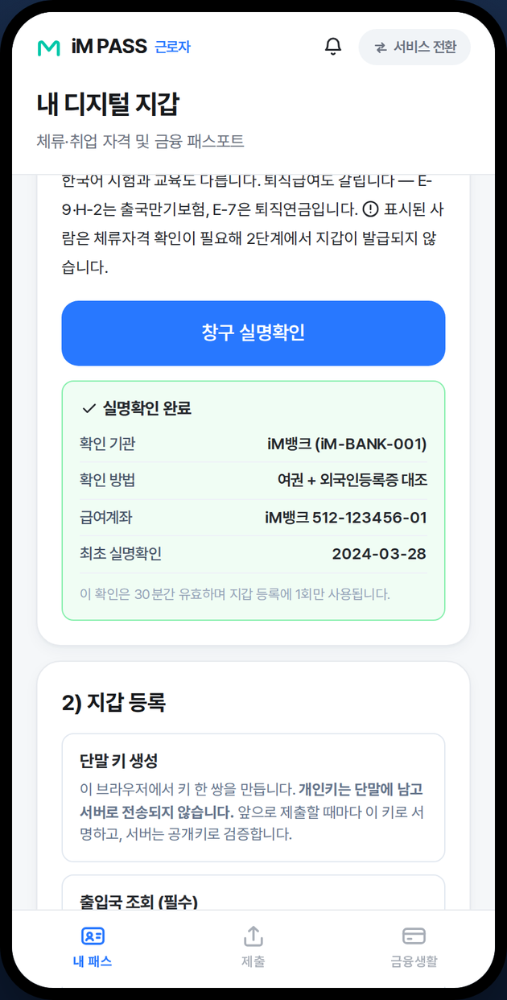<br><sub><b>② 창구 실명확인</b></sub></td><td align="center" valign="top">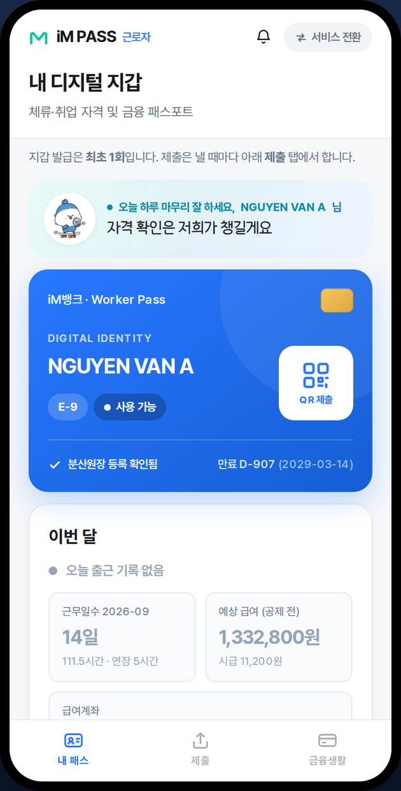<br><sub><b>③ 내 패스 홈</b></sub></td><td align="center" valign="top">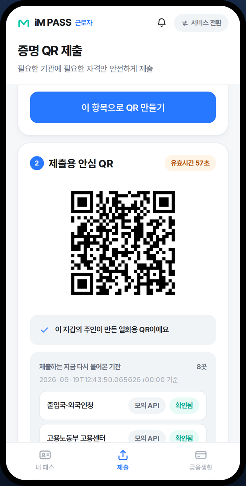<br><sub><b>④ 60초 제출 QR</b></sub></td></tr>
<tr><td align="center" valign="top">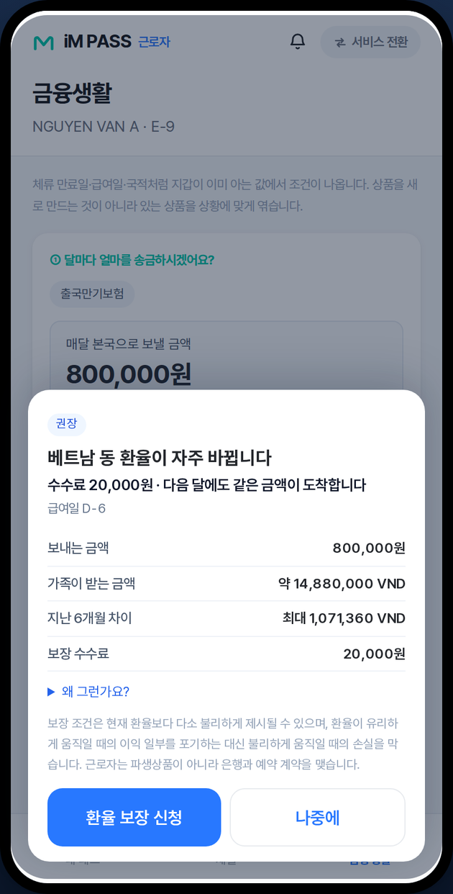<br><sub><b>⑤ 금융생활 · 환율 보장 안내</b></sub></td><td align="center" valign="top">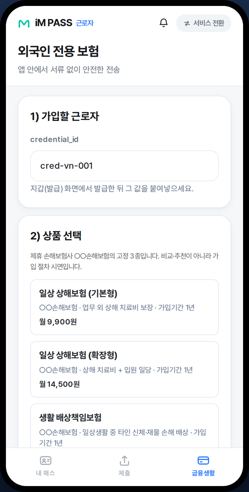<br><sub><b>⑥ 보험 가입(QR 없는 전송)</b></sub></td><td align="center" valign="top">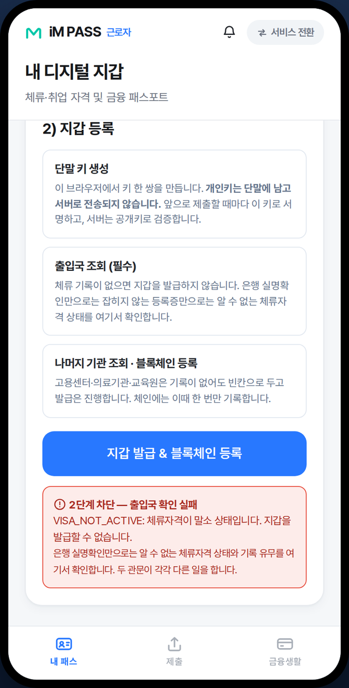<br><sub><b>⑦ 발급 차단(체류자격 말소)</b></sub></td><td></td></tr>
</table>

> **① → ③ 지갑 발급(최초 1회).** 시연 인물을 고르면(①) iM뱅크 창구 실명확인 결과가 먼저 확인되고(②), 단말에서 ECDSA P-256 키를 만든 뒤 출입국 조회를 거쳐 지갑이 발급됩니다(③). 홈에는 체류자격·만료일(D-day)과 이번 달 근무일수·예상 급여가 함께 보입니다.
>
> **④ 제출(매번).** 제출할 곳을 고르면 그곳에 전달되는 항목만 칩으로 보여 주고, 60초 뒤 사라지는 일회용 QR을 만듭니다. QR에는 개인정보가 아니라 일회용 토큰만 담기며, 제출하는 순간 8개 기관에 다시 물어 최신 값으로 전달합니다.
>
> **⑤ 금융생활.** 급여일이 가까우면 환율 보장 송금 카드가 뜹니다. 베트남 동은 원화와 직접 거래되는 시장이 없어 B등급(두 구간 헤지, 수수료 20,000원)으로 안내되고, 송금액이 작아 막아 주는 변동 폭이 수수료보다 작으면 권하지 않습니다. **⑥** 보험은 같은 앱 안에서 QR 없이 보험사로 바로 전송합니다.
>
> **⑦ 발급 차단.** 체류자격이 말소된 NGUYEN THI E는 은행 실명확인은 통과하지만 2단계 출입국 조회에서 `VISA_NOT_ACTIVE`로 막혀 지갑이 발급되지 않습니다.

### 🏭 사업자 화면 (태블릿·키오스크)

<table>
<tr>
<td align="center" valign="top" width="50%">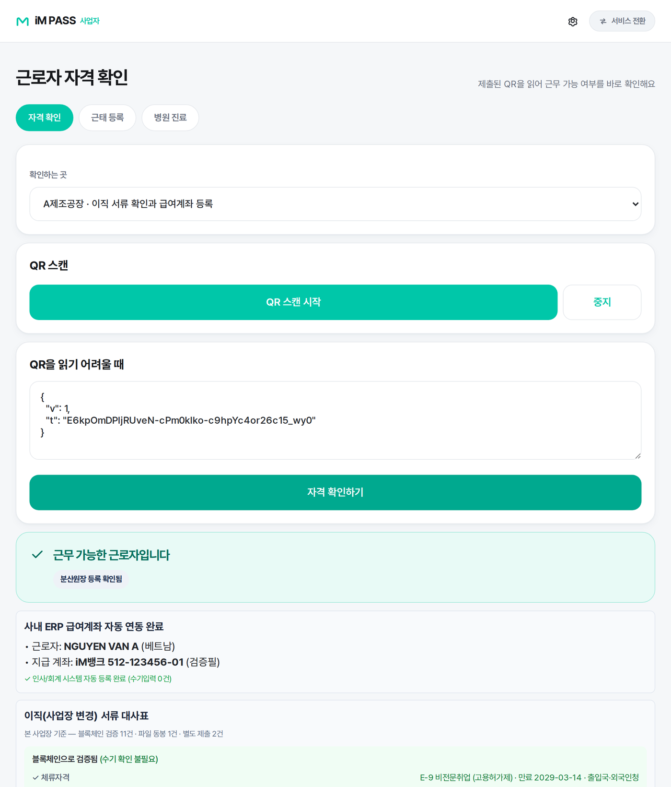<br><sub><b>검증 통과 — 근무 가능 + 이직 서류 대사표</b></sub></td>
<td align="center" valign="top" width="50%">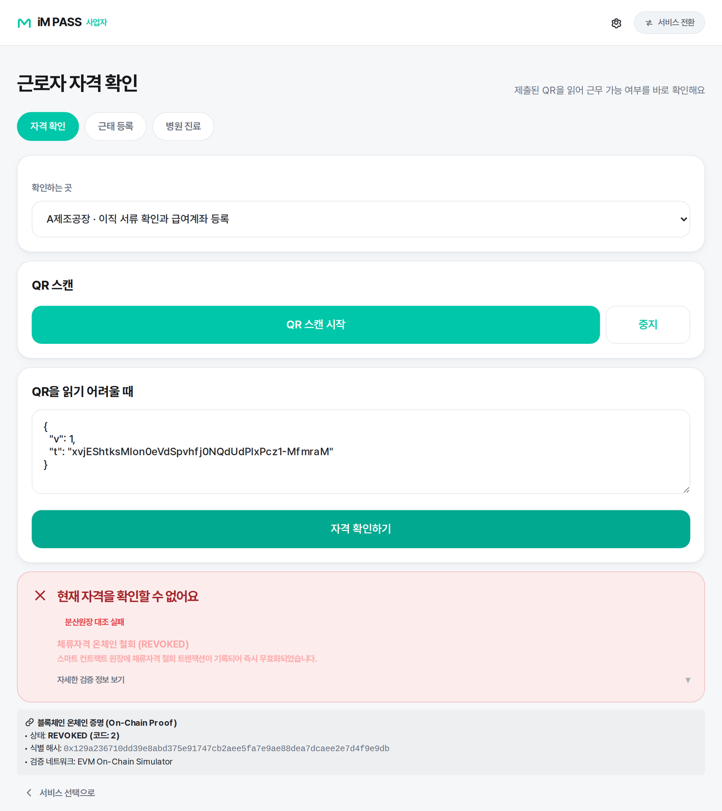<br><sub><b>온체인 철회 후 같은 근로자 — REVOKED 거부</b></sub></td>
</tr>
<tr>
<td align="center" valign="top">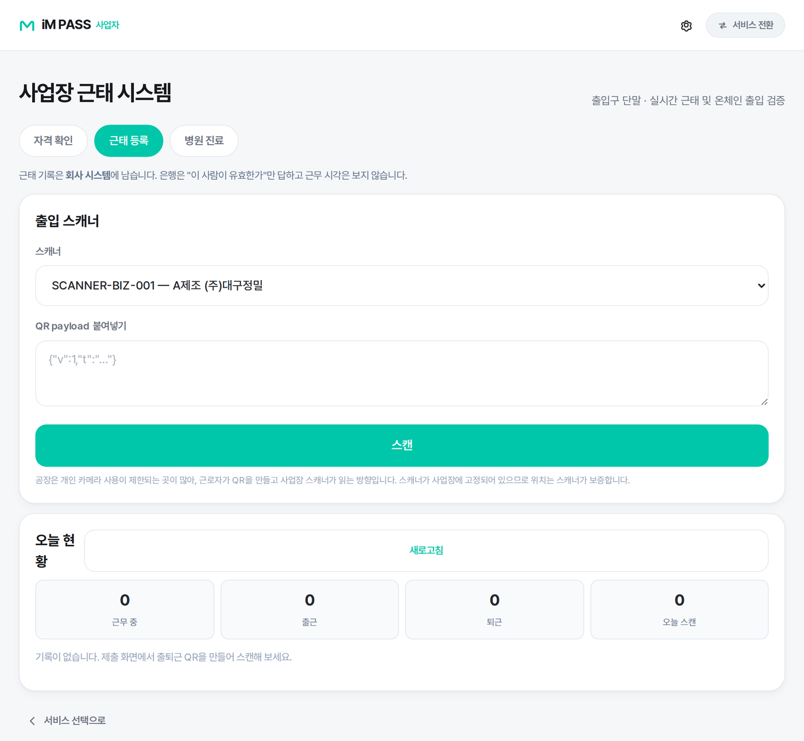<br><sub><b>출입 스캐너 · 오늘 근태 현황</b></sub></td>
<td align="center" valign="top">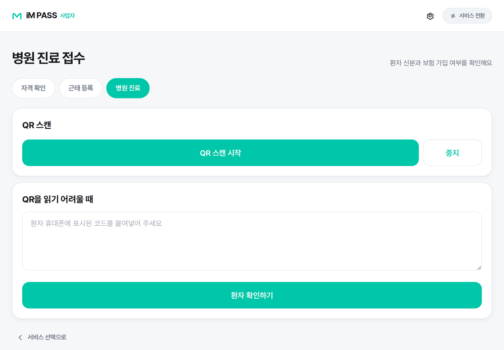<br><sub><b>병원 진료 접수 모드</b></sub></td>
</tr>
</table>

> 사업장은 근로자가 보여 준 QR(또는 붙여넣은 코드)을 읽어 **서명 · 수령처 · 만료 · 철회** 네 가지를 차례로 확인합니다. 통과하면 급여계좌가 사내 ERP에 자동 등록되고, 이직 시 필요한 서류를 "블록체인으로 검증됨 / 대체 불가 / 행정 절차"로 나눈 대사표가 함께 나옵니다. 같은 근로자라도 기관이 자격을 철회하면 바로 다음 스캔에서 `REVOKED`로 거부됩니다. 출퇴근과 병원 접수는 같은 검증 엔진을 쓰는 다른 입구입니다.

### 🏦 은행·기관 화면 (데스크톱 콘솔)

<table>
<tr>
<td align="center" valign="top" width="50%">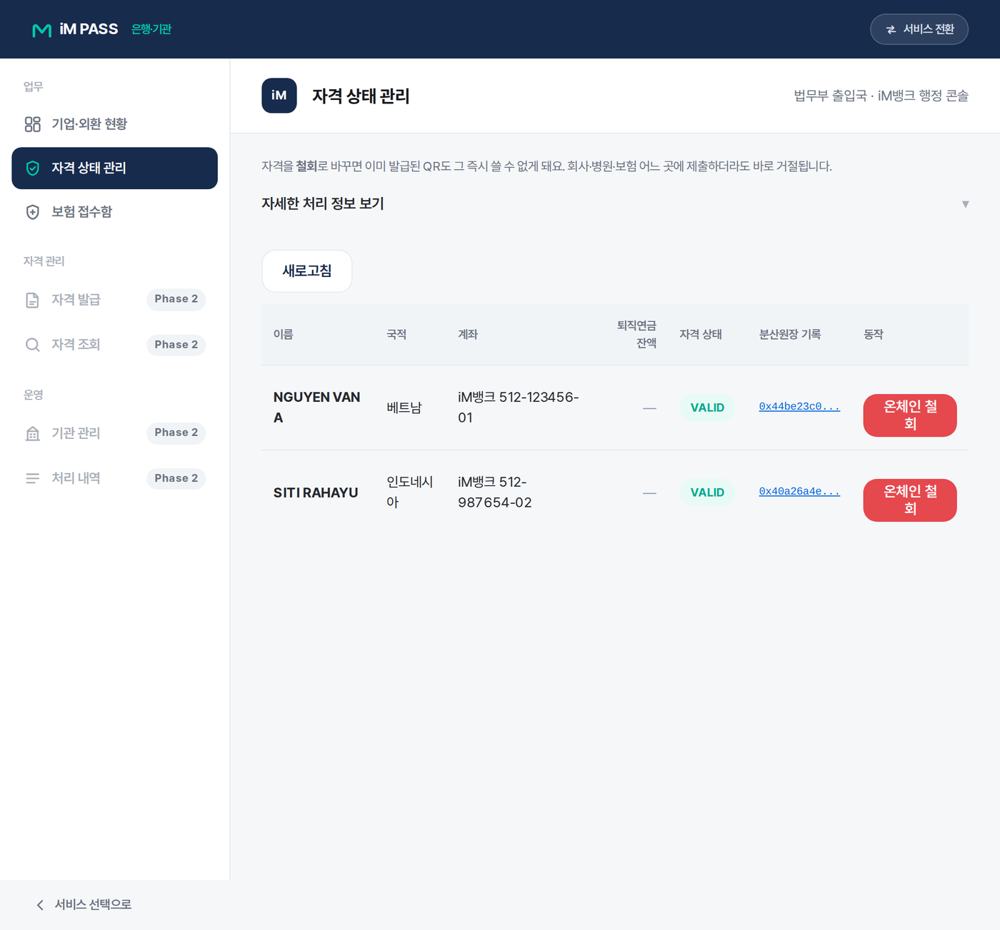<br><sub><b>자격 상태 관리 — 발급된 자격과 온체인 기록</b></sub></td>
<td align="center" valign="top" width="50%">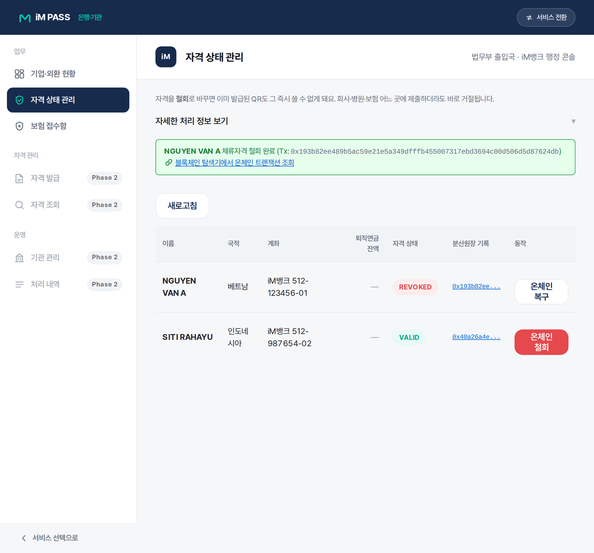<br><sub><b>온체인 철회 완료 — 트랜잭션 해시 표시</b></sub></td>
</tr>
<tr>
<td align="center" valign="top">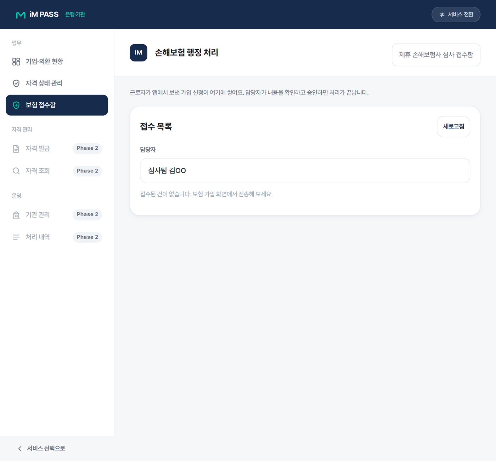<br><sub><b>손해보험 접수·심사함</b></sub></td>
<td align="center" valign="top">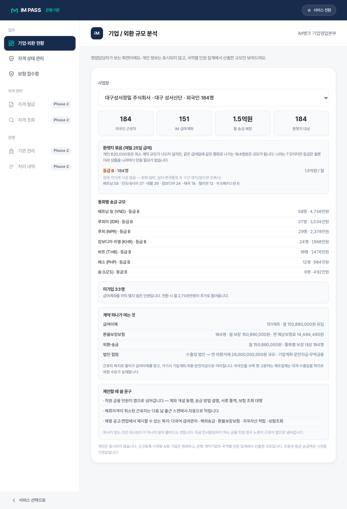<br><sub><b>기업 / 외환 규모 분석</b></sub></td>
</tr>
</table>

> 은행·기관 콘솔에서는 발급된 자격의 상태를 관리합니다. **온체인 철회** 버튼 한 번으로 `CredentialRegistry.revoke()`가 실행되고, 그 순간부터 회사·병원·보험 어느 곳에 제출하더라도 거부됩니다. 복구도 같은 자리에서 합니다. 보험사 담당자는 근로자가 앱에서 보낸 가입 신청을 심사하고, 은행 화면에서는 사업장 단위의 송금 규모와 환헤지 등급 분포를 집계로만 봅니다(개인 송금액은 표시하지 않음).

### 🔁 핵심 시연 한 컷 — 철회 한 번이 모든 제출처에 반영되는 과정

<table>
<tr>
<td align="center" valign="top"><br><sub><b>1. 제출 → 통과</b></sub></td>
<td align="center" valign="top"><br><sub><b>2. 기관이 온체인 철회</b></sub></td>
<td align="center" valign="top"><br><sub><b>3. 새 QR도 즉시 거부</b></sub></td>
</tr>
</table>

> 종이·PDF 증명서는 발급 뒤 자격이 취소돼도 받는 쪽이 알 수 없습니다. iM PASS는 제출될 때마다 블록체인의 상태를 대조하므로, 기관이 철회하는 순간 이미 근로자 손에 있는 지갑으로도 더는 통과할 수 없습니다.

> 📸 모든 화면은 로컬 서버(`http://127.0.0.1:8000`, 블록체인 시뮬레이터 모드)에서 시드 인물 NGUYEN VAN A · NGUYEN THI E로 실제 조작해 캡처했습니다.

---

## 5. 핵심 기술 및 서비스 특징

### 🔒 1) 60초 Dynamic QR & 무저장(Zero-Storage) 검증
* **낡은 증명서 원천 차단**: 증명서를 미리 지갑에 이미지로 저장해 두지 않습니다. 제출처(사업장/병원/은행 등)를 선택하는 순간 공공 API를 실시간 조회하여 최신 데이터로 QR을 생성합니다.
* **ECDSA P-256 서명**: 브라우저 로컬 키스토어에서 생성된 단말 개인키로 페이로드를 전자서명하여 제3자의 대리 제출 및 캡처 이미지 재사용을 방지합니다.
* **유효시간 60초**: 생성된 QR은 60초 후 자동 폐기됩니다.

### ⛓️ 2) 블록체인 레지스트리 (Polygon Amoy Testnet)
* **개인정보 보호 (Zero On-Chain PII)**: 블록체인에는 이름, 주민번호, 여권번호 등 어떠한 개인정보도 올라가지 않습니다.
* **오직 상태 해시만 기록**: 자격 ID의 해시값과 발급/철회/복구 상태(ACTIVE, REVOKED, EXPIRED)만을 스마트 컨트랙트(`CredentialRegistry.sol`)에 기록하여 데이터 주권을 완벽히 보호합니다.

### 💰 3) 자격 기반 맞춤형 생활금융 & 환율 보장
* **체류자격별 퇴직급여 자동 분류**:
  * **E-9 / H-2 (비전문취업/방문취업)**: 외고법에 따른 **출국만기보험** 자동 산정 (출국 14일 이내 수령 프로세스 연동)
  * **E-7 등 (특정활동 전문인력)**: 근로자퇴직급여보장법에 따른 **DC형 퇴직연금** 운용지시 및 2023 사전지정운용제도(디폴트옵션) 반영
* **환율 변동 안심 보장 송금 (FX Hedging)**:
  * 개인 소액 송금 수요를 지갑 데이터를 통해 급여일 단위로 취합, 은행간 외환시장에서 원화-본국통화 간 집합 선물환 헤징 구조 제공
  * 헤지 대상은 **원화와 근로자 본국 통화 사이의 환율**입니다. 등급은 '국내 은행간 시장에서 원화와 직접 거래되는 통화인가' 하나로 나눕니다 — **A등급(원화 직거래: USD, CNY, 한 번의 거래)** / **B등급(그 외: 원화-달러 + 달러-본국통화 두 번, 얕으면 비슷한 통화로 프록시 헤지 · 예: 동→바트)** / **C등급(막아 주는 변동 폭이 수수료보다 작아 권하지 않음)**
  * 헤지 방식은 하나로 고정하지 않으며, 위 내용은 가능한 방식의 사례입니다. 현재 구현은 판정·견적까지이고 실제 계약은 Phase 2입니다.

### 🌍 4) 7개국 다국어 & 안심 잠금화면 알림
* **7개 언어 지원**: 한국어, 영어, 베트남어, 인도네시아어, 우즈베크어, 중국어, 태국어 지원
* **안심 개인정보 번역 필터**: 이름, 계좌번호, 외국인등록번호 등 민감 데이터는 번역 API로 전송되지 않도록 원천 차단(`data-no-translate`)
* **잠금화면 체류만료 알림**: 체류만료 120일 전(연장 신청 개시일), 30일 전(긴급 안내) 시점에 실제 스마트폰 잠금화면 모달 푸시 알림 제공

---

## 6. 시드 인물 페르소나 (시연 시나리오)

iM PASS 프로토타입은 실제 공공기관 연계 시 발생할 수 있는 다양한 케이스를 사전 검증할 수 있도록 5인의 시드 데이터를 내장하고 있습니다.

| 이름 | 국적 | 비자 | 직무 | 시연 포인트 |
|:---|:---:|:---:|:---|:---|
| **NGUYEN VAN A** | 베트남 | **E-9** | CNC 선반 조작 | **표준 시나리오**: 실명확인 → 8개 기관 조회 → 온체인 등록 → 출퇴근 QR 검증 정상 통과 |
| **SITI RAHAYU** | 인도네시아 | **E-9** | 사출 성형 보조 | **근태 및 적금 연동**: 이번 달 결근 1일 반영 급여 계산, 귀국 목표 적금 가입 상태 시연 |
| **NGUYEN THI E** | 베트남 | **E-9 (말소)** | 조립 | **발급 거절 시나리오**: 출입국 자격 말소 감지로 2단계에서 발급 즉시 차단 |
| **LI CHUNHUA** | 중국 | **H-2** | 조리 보조 | **체류 만료 임박 알림**: 체류 만료 63일 전 잠금화면 알림 발생, 원화-위안 직거래 환율보장 적용 |
| **MICHAEL BRENNAN** | 미국 | **E-7-1** | 생산기술 엔지니어 | **전문직 퇴직연금 DC**: 출국만기보험이 아닌 DC형 퇴직연금 포트폴리오 변경 기능 활성화 |

---

## 7. 연계 발급기관 인터페이스 (8개 기관)

| 기관 | 모의 구분 | 제공 정보 |
|:---|:---:|:---|
| **출입국·외국인청** | MOCK | 체류자격 유효성, 외국인등록번호, 체류 만료일 |
| **고용노동부 고용센터** | MOCK | 고용허가 이력, 사업장 변경 내역, 표준근로계약서 정보 |
| **iM뱅크 (주관사)** | **REAL** | **창구 대면 실명확인, 급여계좌 유효성, 금융상품 연동** |
| **지정 의료기관** | MOCK | 마약검사 및 채용 건강진단 유효기간 (민감 진료기록 제외) |
| **한국산업인력공단** | MOCK | EPS-TOPIK 성적, 입국 전 취업교육 이수증 |
| **한국산업인력공단 (Q-Net)** | MOCK | 국가기술자격 취득 내역 (용접, 지게차 등) |
| **한국산업안전보건공단** | MOCK | 기초안전보건교육 이수증 |
| **국립국제교육원** | MOCK | TOPIK 성적 및 법무부 사회통합프로그램(KIIP) 단계 |

---

## 8. 기술 스택 상세

<p align="center">
  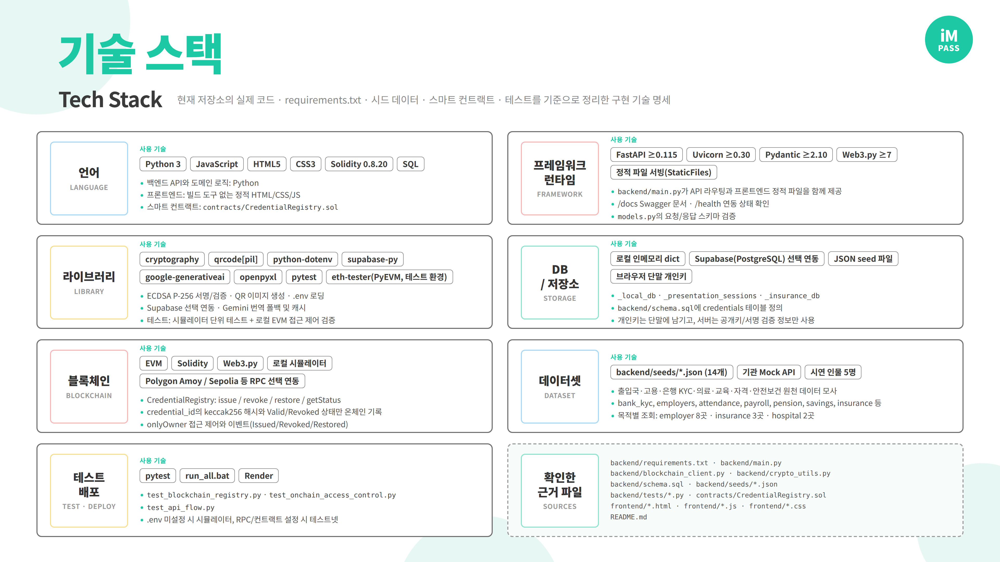
</p>

* **Backend**: Python 3.11, FastAPI, Uvicorn, Pydantic, Cryptography (ECDSA P-256)
* **Blockchain**: Solidity 0.8.20, Web3.py, Polygon Amoy Testnet (내장 메모리 시뮬레이터 지원)
* **Frontend**: Vanilla Modern JS (ES6+), HTML5, CSS3 Custom Properties (iM Design System Tokens)
* **AI & i18n**: Google Gemini API (지능형 문맥 번역) + 7개 국어 내장 로컬 사전 폴백

---

## 9. 빠른 실행 및 시연 가이드

### 🚀 원클릭 실행 (Windows)
```bash
run_all.bat
```
> 스크립트 실행 시 가상환경 생성, 패키지 설치, 로컬 서버(`http://127.0.0.1:8000`)가 원클릭으로 구동됩니다.

### 💻 수동 실행
```bash
cd backend
python -m venv .venv
.venv\Scripts\activate
pip install -r requirements.txt
python -m uvicorn main:app --reload --port 8000
```

* **서비스 런처 접속**: `http://127.0.0.1:8000/home.html`
* **Swagger API 문서**: `http://127.0.0.1:8000/docs`
* **시스템 헬스체크**: `http://127.0.0.1:8000/health`

### 🧪 핵심 시연 5단계
1. **런처(`home.html`) 접속** → `iM PASS 근로자` 선택
2. **NGUYEN VAN A** 선택 후 지갑 발급 진행 (창구 실명확인 → 단말 키 생성 → 8대 기관 조회 → 온체인 등록)
3. **제출하기** 탭에서 '사업장 출퇴근용 QR' 생성 후 페이로드 복사
4. 새 창에서 `iM PASS 사업자(`scan.html`)` 열고 페이로드 검증 → **녹색 통과 확인**
5. **검증 무결성 테스트**: 페이로드 문자 1글자 위조 시 `SIGNATURE_INVALID` 오류, 관리자 화면(`admin.html`)에서 온체인 철회 후 재검증 시 `REVOKED` 차단 확인

---

## 10. REST API 명세

| Method | Endpoint | Description |
|:---:|:---|:---|
| `GET` | `/health` | 시스템 상태 및 블록체인 노드 연결 모드 확인 |
| `GET` | `/agencies` | 8개 발급기관 목록 및 목적별 조회 스키마 |
| `POST` | `/wallet/bank-verify` | iM뱅크 창구 대면 실명확인(KYC) 대조 |
| `POST` | `/wallet/register` | 단말 ECDSA P-256 공개키 등록 및 지갑 생성 |
| `POST` | `/credentials` | 신원자격 패스 발급 및 Polygon 온체인 레지스트리 기록 |
| `GET` | `/wallet/{cid}` | 지갑 상태, 기관별 조회 이력, 체류만료 알림 조회 |
| `GET` | `/passport/{cid}` | 금융 패스포트 (근태, 급여, 퇴직급여, 적금, 송금, 귀국정산) |
| `POST` | `/presentations/secure` | 단말 전자서명 기반 60초 Dynamic QR 생성 |
| `POST` | `/verify` | 수령처 단말의 자격 상태 및 전자서명 무결성 검증 |
| `POST` | `/attendance/scan` | 사업장 QR 스캐너 연동 출퇴근 등록 |
| `POST` | `/pension/allocation` | E-7 전문직 퇴직연금 DC 운용상품 변경 |
| `GET` | `/fx/quote/{cid}` | 본국 통화 송금 환율보장(FX Hedge) 견적 산출 |
| `POST` | `/admin/credentials/{cid}/revoke` | 블록체인 스마트 컨트랙트 자격 즉시 철회 |

---

## 11. 비즈니스 기대효과 & 확장 로드맵

<p align="center">
  
</p>

> **"금융 취약계층 포용을 넘어, 지역 산단과 상생하는 iM뱅크 신성장 동력"**

1. **외국인 주거래 은행 선점**: 대구·경북 및 전국 250만 외국인 주민 중 E-9/E-7 근로자의 급여계좌 유치를 통한 요구불 예금 증대
2. **외환 및 비이자 이익 극대화**: 정기 해외송금 수요를 독점적으로 확보하여 안정적인 수수료 및 환헤지 스프레드 수익 창출
3. **기업금융(B2B) 시너지**: 외국인 고용 기업체 대상 주거래 우대 및 외환 컨설팅 제공으로 기업금융 영업 접점 대폭 확대
4. **글로벌 하이브리드 뱅크 도약**: 향후 베트남, 캄보디아 등 iM뱅크 글로벌 현지법인과 연계하여 출국 전 계좌 개설 및 귀국 후 금융 자산 연계까지 지원하는 국경 없는 글로벌 금융 패스로 확장

---

<p align="center">
  <strong>iM PASS Team — 2026 AI Blockchain Challenge in Daegu</strong><br>
  <sub>Copyright © 2026 iM Bank & iM PASS. All rights reserved.</sub>
</p>
